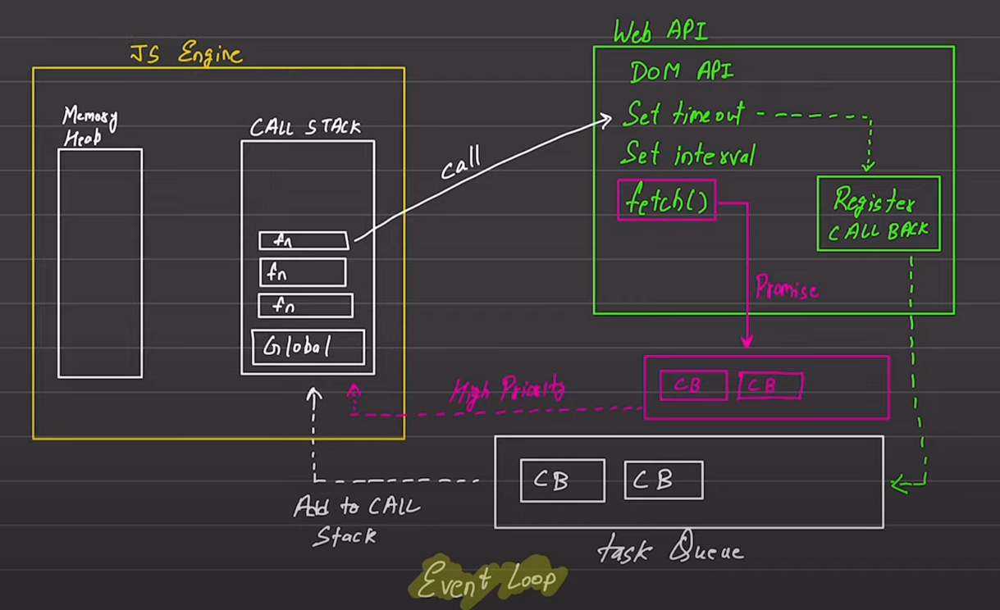
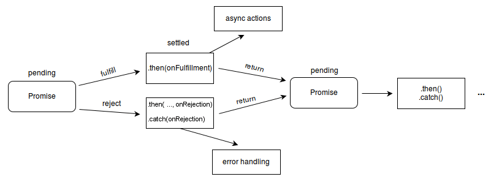

# This repo contains the notes for the javascript.

## Word vs Keyword

Word doesn't contain any semantics in JS, while keywords contain semantics

hello ---> word </br>
for ---> keyword

## variable & constants

variable ---> stores changing values </br>
constant ---> stores immortal values

## var, const & let

- var --->
  -- defined in ES5
  -- it is function scope
  -- var adds itself to the window object

```javascript
funticon abcd(){
for(var i =0; i<10; i++){
console.log(i);
}
console.log(i); // is valid and gives value to i=10 bcz i is declared inside function abcd and is valid throughout the function.
}
```

- let / const --->
  -- defined in ES6
  -- it is braces-scoped
  -- let/const doesn't add itself to the window object

```javascript
funticon abcd(){
for(let i =0; i<10; i++){
console.log(i);
}
console.log(i); // is invalid and gives error bcz though i is declared inside function abcd but it will be valid only inside the following braces.
}
```

## Window Object

**Many features aren't available in JS but we can use them as JS extracts them from the window and thus these are known as window objects.**

**This is one of the main issues and reasons why let was introduced as var adds itself into the window object and thus exposes the data which can lead to breaches.**

## Hoisting

a variable or function can be used before its declaration.

```javascript
console.log(a); // valid command
var a = 100;
```

When the interpreter encounters line number 21 it basically breaks it into two commands
var a; & then the actual command i.e. console.log(a);

Hoisting behavior is different for let & const and var.

## Types in Javascript

- Primitive: number, boolean, string, undefined, null, symbol, object, bigint
- Reference : [], {}, ():: when these values are copied then real values aren't copied but the reference value is passed. Changes made to these data types are affected in the main variable.

**JavaScript evaluates expressions from left to right:**

```javascript
let x = 20+10+"Yash";  ---> 30Yash

let x = "Yash"20+10+;  ---> Yash2010

```

## Conditionals (if, else, else-if )

```javascript
if (condition) {
  // statement
} else if (condition) {
  // statement : if (if) condition is false
} else {
  // if above conditions are not met then else is executed.
}
```

## Truthy & Falsey values

In JavaScript, everything is either a truthy value or a falsey value.

- Falsy: 0, Flase, undefined, null, NaN, "" or ''
- Truthy: all values other than falsy values

```javascript
if("Yash){
    consle.log("Hii, Yash");
}
else{
    console.log("Not known!")
}
if("NaN){
    consle.log("Hii, Yash");
}
else{
    console.log("Not known!")
}

```

## Loops (for, forEach, for-in, while, do-while)

```javascript
for (var i = 0; i < 10; i++) {}

// forEach works on array
var a = [1, 2, 3, 4, 5, 6, 7, 8, 9];
a.forEach(function (val) {
  console.log(val + 2); //forEach by default doesn't edit the real value of array.
});

// forIn works on objects
var obj = {
  name: "Yash",
  age: 21,
  city: "New Delhi",
};

for (var key in obj) {
  console.log(key, obj[key]); // key is the variable name
}

while (condition) {}

do {} while (condition);
```

## Functions

```javascript
function function_name(parameters) {
  // defination
  //statements
}

function_name(arguements); // function call
```

### Arrow Functions

```javascript
// normal arrow function
const var_name = () => {
    //statement
    // when using {} we have to use return keyword
}

// implicit arrow function
const var_name = () = ( x + y ) // single line statement without return with use of ()
```

### Immediately Invoked Function Expression (IIFE)

When the function are called as soon as it is declared are know as IIFE reason to do it is to prevent errors from global scoping polluting with variables.
<br>
These function doesnt end with the block scope and thus need semicolon(;) at end.

```javascript
    ()(); // syntax for the IIFE
// (function-defination) (function call);


// use with classic function also known as named IIFE
(function func_name() {
    //statements
})();


// use with arrow function also known as unnamed IIFE
(() => {
    //statements
})();


((dbName) => {
    console.log(`Connect to DB -> ${dbName}`)
})(database_name);


```

### Callback Functions

The functions which are executed when a certain task is completed are known as callback functions.

### First-class Functions

In javascript variables can carry a value as a function.

```javascript
function abcd(a){
    a();
}

abcd(function(){console.log("Yash");})

<!--    here a = function(){
        console.log("Yash");
        } -->

```

## Arrays

group of similar data types values stored in a linear fashion in memory.

```javascript
var arr = [1, 2, 3, 4, 5, 6, 7, 8, 9];
```

### Push Pop Shift Unshift Splice

arr.pop(); ---> removes the last value from the array

arr.push(10) ---> adds the given argument at the end of the array

arr.shift() ---> removes the first value from the array

arr.unshift(0) ---> adds the given argument at the beginning of the array

arr.splice(start_index, no. of elements) ---> remove elements from the middle of array

arr.splice(2,5) ---> remove from 2 index and 5 elements i.e (3,4,5,6,7)

### Array declaration behind the scenes

Array created in JS aren't stored as array but as objects.

```javascript
var arr = [9,8,7,6,5,4];  --->  arr = {
                           |             0:9,
                           |             1:8,
                           |             2:7,
                           |             3:6,
                           |             4:5,
                           |             5:4
                           |         }
```

To check if it's an array one can use a function called isArray([]).

### Negative indexes can be given in an array

As an array is stored as an object it can be done.

```javascript
var arr = [9,8,7,6,5,4];  --->  arr = {
arr[-1] = 10;               |            0:9,
                            |            1:8,
                            |            2:7,
                            |            3:6,
                            |            4:5,
                            |            5:4,
                            |            -1:10
                            |        }
```

## Object

1. Blank object: var a = {};
2. Filled object :

```javascript

   const mySymbol = symbol("value1);

   var a= {
   name : "Yash",
   age = 21,
   email : "workspacesyash7202@gmail.com",
   role : function_name() {},
   "days in job" : 500,
   [mySymbol] : "value2";
   }
```

a.name ---> To access the property of an object

a.name = "Carter"; ---> to update the value of any property of an object

delete a.role; ---> to delete a property from an object

By default the keys are of type string and is interpreted as "name" : "yash" but when we want to declare a string key value then dot(.) operator doesn't work.

To access it we need to pass it as string: a["days in job"]

To have a symbol data type as key we need to explicitly declare it in square brackets:
now the type of mySymbol in object is symbol.

### Property VS Method

Any property of an object whose value is a function is known as a Method.

## Using "this" keyword

In JavaScript, this keyword refers to an object. Which object depends on how this is being invoked (used or called).
The 'this' keyword refers to different objects depending on how it is used:
|Method|Reference|
|---|---|
|Object| This refers to the object|
|Alone| This refers to the global object|
|Function| This refers to the global object|
|Function| In a strict mode, this is undefined|
|Event| This refers to the element which received the event|

## Stack

When a primitive variable is declared then you get a copy of the variable value and changes to it doesn't changes the original value.

```javascript
let myName = "YASH";
let myOtherName = myName;

myOtherName = "carter";

console.log(myName);        --> YASH
console.log(myOtherName);   --> carter


```

## Heap

When a non-primitive variable is declared then you get a reference of the variable and changes to it changes the original value.

```javascript
let myID= {
    name: "yash"
    age: 21
}

console.log(myID.name);        --> YASH

let myID2 = myID;

myID2.name = "carter";

console.log(myID.name);        --> carter
console.log(myOtherName);   --> carter
```

## JavaScript Execution Context

When a javascript file is put to execution then three phases are encountered:

1. Global Execution Context : in this all the elements are assigned to this operator. (global EC is different for browser, node and engines but in browser value of this is in window object.)
2. Function Execution Context
3. Eval Execution Context

### Phases of code execution in JS

1. Memory Creation Phase : variable are declared with undefined value and function definations are defined
2. Execution Phase : variables are assigned the values and computions are made and fuctions are called.

When a function is executed it makes its own imaginary container which contains three parts:

1. Variables
2. Functions inside that parent function
3. Lexical Environment of that function

```javascript
let num1 = 10;
let num2 = 20;

function addtwo(n1, n2) {
  return (result = n1 + n2);
}
console.log(addtwo(num1, num2));
```

Execution :

1. Global
2. Memory :

   - num1 - undefined
   - num2 - undefined
   - addtwo - defination

3. Execution :
   - num1 - 10
   - num2 - 20
   - call of addtwo : creates a new variable environment and it runs step 2 and 3 in a single thread and **now the return of this functions goes to global execution**.

### Lexical Environment

it is technically a chart containing the scope & scope-chain of that particular function i.e. contains information about things that a particular function can access and what it cannot.

## How to copy reference values

it is done by using the spread operator '...' as it copies the value from a variable or object.

```javascript
var a = [1, 2, 3, 4, 5, 6, 7, 8, 9];
var b = [...a]; //This gives b a copy of a and changes made to b don't reflect in a.

var obj1 = { nmae: "Yash" };
var obj2 = { ...obj1 };
```

## DOM

- document.getElementById("id").

  - innerHTML -> gives all the values inside a given element even html inside it.
  - innerContent -> gives all the text inside a given element even if its is hidden by css
  - innnertext -> gives onlt the visisble text at the image

- document.querySelector("tag_name i.e h2") : gives first h2 element on the page, and it works with all types css selectors when passed as parameters.

- document.querySelectorAll("tag_name") : gives nodelist of all the element present with the parameter passed, **also nodelist list is not array** but have some features like forEach() for working; it works with all types css selectors when passed as parameters.

- document.getElementByClassName("class") : gives HTML collection of the class items and is needed to be converted to array using Array.from(variable_name).

## Events

```javascript
document.getElementById("parent").addEventListener(
  "click",
  function (e) {
    console.log("clicked parent);
  },
  false
);
document.getElementById("child").addEventListener(
  "click",
  function (e) {
    console.log("clicked child);
    e.stopPropagation();
  },
  false
);
```

The Event propagations goes with two senarios :

- Event Capturing : true, follows top-down approach i.e first parent then child
- Event Bubbling : false (default), follows bottoms-up approach i.e first child then parent

And to stop propagation stopProgation() is used.

## Async fundamentals

By default JS is Synchronous but to have some functions run and respond at a certain time we can make then asynchronous.


## Promise

is an object representing the eventual completion or failure of an asynchronous operation.

A promise has three states :

- pemding : initial state
- fulfilled : completed susscessfully
- rejected : failed



To handel the promises we have three methods :

- **.catch()** : Appends a rejection handler callback to the promise, and returns a new promise resolving to the return value of the callback if it is called, or to its original fulfillment value if the promise is instead fulfilled.

- **.finally()** : Appends a handler to the promise, and returns a new promise that is resolved when the original promise is resolved. The handler is called when the promise is settled, whether fulfilled or rejected.

- **.then()** : Appends fulfillment and rejection handlers to the promise, and returns a new promise resolving to the return value of the called handler, or to its original settled value if the promise was not handled

```javascript
const promiseOne = new Promise((resolve, reject) => {
  setTimeout(() => {
    const check = true;
    if (!check) {
      console.log("its done");
      resolve({
        username: "Carter",
        age: 21,
      });
    } else {
      reject("Error : something went wrong");
    }
  }, 1000);
});

promiseOne
  .then((username) => {
    console.log(username);
  })
  .catch((error) => {
    // catch is used for reject
    console.log(error);
  })
  .finally(() => {
    console.log("The promise is either resolved or rejected");
  });
```

OR we can use **async-await** :

but we have to use it in try and catch to hande l errors gracefully.

```javascript
const promiseOne = new Promise((resolve, reject) => {
  setTimeout(() => {
    const check = true;
    if (!check) {
      console.log("its done");
      resolve({
        username: "Carter",
        age: 21,
      });
    } else {
      reject("Error : something went wrong");
    }
  }, 1000);
});

async function consumePromiseFour() {
  try {
    const response = await promiseFour;
    console.log(response);
  } catch (error) {
    console.log(error);
  }
}

consumePromiseFour();
```

## JavaScript & classes

Classes in javaScript are recently introduces in ES6 (2015). JavaScript is a protype-functional-language. Though it now has classes and objects but it works in prototype functioning behind the scenes.

The `new` keyword gives us a new instance of that object and is basically a constructor.

When `new` keyword is used :

1. Empty object literal is created `{}` known as instance.
2. A constructor function is called and given arguements are passed.
3. Now `this` keyword injects all the arguements into the object literal.
4. Retured in the function to use.

## Prototype

Evrything in JavaScript is an object. and prototype is a wy in which JS gives one layer up from current element to object to gives more features to it. then more it goes to proto-roots.

While tracking layers up and it includes all the parent element features to it.

```javascript
function multiplicationNum(num) {
  return num * 10;
}

console.log(multiplicationNum(10));
console.log(multiplicationNum);
console.log(multiplicationNum.prototype);
console.log(multiplicationNum.prototype.prototype); // function -> object -> null
```
